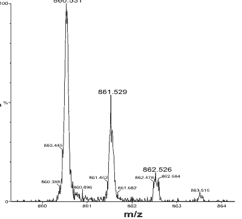
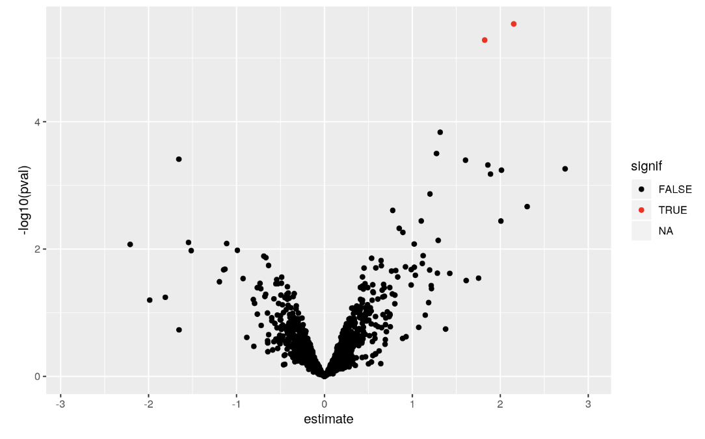

---
title: "Mass spectrometry"
author: "Cauã Westmann, Ahmadreza Yousefkhani, Alexander Schanne, Flavio Rump"
date: "29.09.2019"
output: github_document
---

```{r setup, include=FALSE}
knitr::opts_chunk$set(echo = TRUE)
```

# Mass Spectrometry

## Introduction
Mass spectrometry is an analytical chemistry technique that helps identify the amount and type of chemicals present in a sample by measuring the mass-to-charge ratio and abundance of gas-phase ions.     
It works by ionizing chemical compounds to generate charged molecules or molecule fragments and measuring their mass-to-charge ratios. Here is some videos introducing MS: 
* [](https://www.youtube.com/watch?v=J-wao0O0_qM&t)
* [](https://www.youtube.com/watch?v=sTi--ixdAME)

## How it works
Basic steps: 

* Sample (solid, liquid, gas) is ionized – there are different methods for ionization (e.g. electron impact, chemical ionization, electrospray, etc.)    
* Ions are separated according to their mass-to-charge ratio (m/z) – there are also different mass analyzers such as single quadrupole, triple quadrupole, time-of-flight, Ion Trap, etc.    
* Ions are detected by a mechanism capable of detecting charged particles (e.g. electron multiplier)    
* Results are displayed as spectra of the relative abundance as a function of m/z ratio     
* Identification is done by correlating known masses to the identified masses or through a characteristic fragmentation pattern    

## Different types of mass spectrometry
Mass spectrometry can also be coupled to other systems depending on the sample type and the biological question (e.g. gas chromatography-MS - analysis of volatile compounds in complex samples, liquid chromatography - analysis of thermally unstable molecules in complex samples MS, MS-MS – allows fragmentation and analysis of the analysis of large biomolecules, such as proteins and peptides). 

## Mass spectrometry data analysis
The mass spectrum of a sample is the distribution pattern of the components of that collection, whether atoms or molecules based on the mass to charge ratio ([Wikibooks](https://en.wikibooks.org/wiki/Proteomics/Protein_Identification_-_Mass_Spectrometry/Data_Analysis/_Interpretation)). Mass spec data contains mass to charge ratio of ions. Here is an example of mass spec data:

{width=350px}
    
The y-axis represents signal intensity. Signal intensity depends on certain factors such as the nature of the molecules being analyzed, how they ionize, the buffers' interaction, and the sample interaction. But it correlates with the relative abundance. 
There are some packages in R like “readMSData” which can read raw MS data and store them in a container ([CSAMA 2019](https://github.com/Bioconductor/CSAMA)). After normalization, the median-summarised protein data or robust-summarised data could be calculated and a model could be fitted to the data. Furthermore, after estimation, the inference is possible. The design matrix is specified and the contrasts are calculated. Further, we can have the adjusted p-values and draw a volcano plot. Hence the differentially expressed proteins could be found.

{width=350px}

Here are some links that explain a pipeline for analyzing mass spec data:    
1- [CSAMA workshop 2018](https://github.com/Bioconductor/CSAMA)     
2- Yu, Fang, F. Qiu, and J. Meza. "Design and Statistical Analysis of Mass-Spectrometry-Based Quantitative Proteomics Data." Proteomic Profiling and Analytical Chemistry. Elsevier, 2016. 211-237.     
3- Choi, Meena, et al. "MSstats: an R package for statistical analysis of quantitative mass spectrometry-based proteomic experiments." Bioinformatics 30.17 (2014): 2524-2526.


